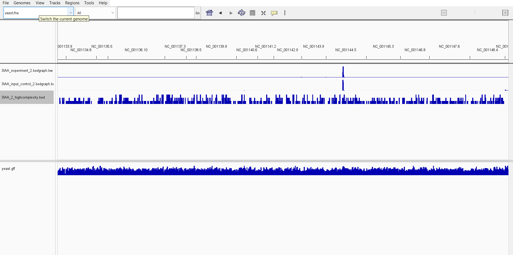

This project analyzes yeast samples from the paper ["Yeast Mediator facilitates transcription initiation at most promoters via a Tail-independent mechanism"](https://www.cell.com/molecular-cell/fulltext/S1097-2765(22)00905-4?_returnURL=https%3A%2F%2Flinkinghub.elsevier.com%2Fretrieve%2Fpii%2FS1097276522009054%3Fshowall%3Dtrue). 

The general workflow for this project was to: 
- Obtain reads from the SRA. 
- Align reads to SacCer3 genome using bowtie (ebwa). Reference genome and the corresponding gff was obtained using the ncbi datasets command line tool.
- Call peaks using macs2. 
- Visualize peaks and signals using IGV.
- Find motifs with the MEME suite.

## Experimental Design

The experimental design can be inferred from the following diagram:

The authors included two input controls and IP experiments for each experimental condition. The conditions were separated into **DMSO** and **3IAA**, with respective genotypes.

## Analysis Decisions

To enhance signal clarity for downstream analyses, replicate BAM files were pooled together for peak finding and motif discovery. While this approach may obscure some differences between replicates, it provides stronger overall signals for identifying binding sites.

After peaks were found, peaks were refined through: 

`cat output.bed | awk ' $5> 10 { print $0 }' > highscore.bed`

`sdust reference.fa > lowcomplexity.bed`

`bedtools intersect -v -a highscore.bed -b lowcomplexity.bed > highcomplexity.bed`

Credit goes to the Biostar handbook for suggesting these steps. 

## Peaks

To annotate the peaks, I had tried following what the authors did. This involved obtaining the gff file with transcription start sites as obtained in [Park et al. (2014)](https://pubmed.ncbi.nlm.nih.gov/24413663/). These attempts can be found in results/bed_file_mods/{condition}_annotated_peaks.bed . Alternatively, the annotated 

All steps from here followed [Ming Tang's guide to ChIP-Seq analysis](https://divingintogeneticsandgenomics.com/publication/2017-08-01-biostarhandbook/). 

## Heatmaps

Heatmaps were created to compare expression between DMSO and 3IAA conditions. 

## Metaprofile

The DMSO conditions appeared to have stronger signals throughout, except in the 3rd genomic condition which was: 
MAT{alpha} Dade2::hisG his3D200 leu2D0 lys2D0 met15D0 trp1D63 ura3D0 RPB3-3xFlag::NATMX pGPD1-OSTIR::HIS3 SUA7-13x Myc::HPH MED14-3xV5 IAA7::KanMX

This last set of genetic modifications appeared to neutralize most differences between conditions. This was consistent with what the authors found in figure 5b, with the DMSO condition having a stronger signal in most cases. 

## Motifs

